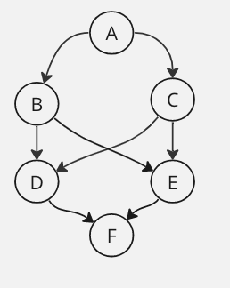

# Graph traversal using depth first search 

## Edge List
This is a `directed` graph represented as an `Edge List` - set of nodes and edges

Time Complexity is O(N + E)

Here is an example graph 



This can be denoted in JSON like 

```
{
    "nodes": [{
        "name": "A"
    }, {
        "name": "B"
    }, {
        "name": "C"
    }, {
        "name": "D"
    }, {
        "name": "E"
    }, {
        "name": "F"
    }],
    "edges": [{
        "from": "A",
        "to": "B"
    }, {
        "from": "A",
        "to": "C"
    }, {
        "from": "B",
        "to": "D"
    }, {
        "from": "B",
        "to": "E"
    }, {
        "from": "C",
        "to": "D"
    }, {
        "from": "C",
        "to": "E"
    }, {
        "from": "D",
        "to": "F"
    }, {
        "from": "E",
        "to": "F"
    }]
}
```

        
